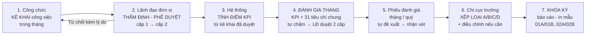

# Mục 2 — Mô tả chức năng phần mềm và quy trình nghiệp vụ

> Phục vụ công văn 153/CNTT ngày 08/7/2026. Lập ngày 30/07/2026.
> Phần mềm: **Hệ thống theo dõi, đánh giá KPI & Nền tảng Digital Learning** — Chi cục Hải quan Khu vực VIII (https://kpihaiquan.vn).

## 1. Mục tiêu, phạm vi, đối tượng sử dụng

- **Mục tiêu:** số hóa toàn trình việc kê khai công việc, thẩm định, phê duyệt, chấm điểm KPI, đánh giá tiêu chí chung và xếp loại chất lượng hằng tháng/quý của công chức; mở rộng thành nền tảng số nội bộ (đào tạo trực tuyến, họp không giấy, diễn đàn nghiệp vụ, chỉ tiêu đơn vị).
- **Phạm vi:** nội bộ Chi cục Hải quan Khu vực VIII — 15 đơn vị, 558 tài khoản công chức/người lao động.
- **Đối tượng sử dụng:** toàn thể công chức (kê khai, xem kết quả); lãnh đạo các cấp (thẩm định, phê duyệt, đánh giá); Chi cục trưởng/Phó Chi cục trưởng (xếp loại, điều chỉnh); cán bộ TCCB (tổng hợp, đối soát, báo cáo); quản trị hệ thống.

## 2. Danh mục chức năng theo module

### 2.1. Module KPI (module lõi — production từ đầu 2026)

| Nhóm chức năng | Nội dung |
|---|---|
| Kê khai công việc (`ke_khai`) | Công chức chọn công việc từ danh mục chuẩn (~2.900 đầu việc/16 lĩnh vực), khai số lượng sản phẩm, minh chứng; kê khai theo tháng; lưu nháp/gửi duyệt; công việc yêu thích (kê nhanh) |
| Kê khai lãnh đạo | Lãnh đạo (PDV/TDV/PCCT/CCT) kê khai riêng theo bộ chỉ số lãnh đạo; từ 04/2026 áp dụng công thức cộng sản phẩm cấp dưới |
| Thẩm định – phê duyệt (`phe_duyet`) | Duyệt 2 cấp tại đơn vị; duyệt từng đơn hoặc duyệt hàng loạt (bulk); từ chối kèm lý do; xử lý đúng trường hợp công chức điều chuyển đơn vị giữa kỳ |
| Đánh giá tháng (`danh_gia`) | Hệ thống tổng hợp điểm KPI từ kê khai đã duyệt; công chức tự chấm 31 tiêu chí chung (thang bội 0,5); lãnh đạo duyệt tiêu chí chung 2 cấp; đánh giá Hội đồng lãnh đạo (HDLD) cho các nhóm chức danh |
| Phiếu đánh giá | Phiếu nhận xét, đánh giá THÁNG và phiếu đánh giá xếp loại QUÝ (tự đề xuất → nhận xét → quyết định); in mẫu 01A/01B (tháng), 02A/02B (quý) dạng Word/PDF |
| Xếp loại (`xep_loai`) | Chi cục trưởng xếp loại A/B/C/D tháng và quý cho toàn Chi cục; bảng tổng hợp theo đơn vị; điều chỉnh điểm tiêu chí chung từng người (modal sửa điểm); khóa/mở khóa kỳ đánh giá |
| Điều chỉnh kết quả | Điều chỉnh kết quả công việc (`dieu_chinh_kqcv`), điều chỉnh đánh giá tháng theo từng tiêu chí — chỉ CCT; mọi điều chỉnh lưu lịch sử |
| Nghỉ phép (`nghi_phep`) | Đăng ký nghỉ, duyệt nghỉ, thống kê ngày nghỉ (16.448 lượt đã ghi nhận) |
| Báo cáo – xuất dữ liệu | Báo cáo xếp loại tháng/quý, thống kê theo đơn vị/lĩnh vực/nhóm công việc, xuất Excel, in bảng kê |
| Đối soát (TCCB) | Trang đối soát đánh giá tháng: TCCB tự kiểm tra ai/đơn vị nào chưa hoàn tất từng bước quy trình, xuất Excel |
| Quản trị | Quản lý tài khoản (kích hoạt/vô hiệu, reset mật khẩu), danh mục công việc, tham số nghiệp vụ, lịch sử điều chuyển đơn vị (có ngày hiệu lực), phân quyền platform role |

### 2.2. Module LMS — Đào tạo trực tuyến (Digital Learning)

| Nhóm chức năng | Nội dung |
|---|---|
| Khóa học – bài học | Quản lý khóa học, chuyên đề, bài học (video/tài liệu), đăng ký học, theo dõi tiến độ |
| Bài kiểm tra | Ngân hàng câu hỏi theo khóa học, làm bài, chấm tự động, lưu kết quả |
| Đánh giá năng lực (ĐGNL) | Ngân hàng ~1.200 câu hỏi/11 lĩnh vực nghiệp vụ; cấu trúc đề + template đề; kỳ thi tập trung có ca thi |
| Kỳ thi | Tổ chức ca thi, xác nhận dự thi trước giờ, làm bài trực tuyến; **giám sát chống gian lận**: 1 phiên thi duy nhất/thí sinh, cờ thoát fullscreen, ghi vi phạm giờ + lý do, giám sát trực tiếp của quản trị; tính điểm best-score giữa các lượt |
| Chứng chỉ – khảo sát – báo cáo | Cấp chứng chỉ hoàn thành, khảo sát sau khóa học, báo cáo kết quả đào tạo; import câu hỏi/thí sinh từ Excel |

### 2.3. Module HKG — Họp Không Giấy

Quản lý cuộc họp, thành phần dự họp (nhóm thành phần), tài liệu họp, trình chiếu tài liệu đồng bộ thời gian thực qua WebSocket (điều khiển trang từ chủ tọa), ý kiến góp ý, kiểm soát quyền truy cập từng cuộc họp (log định danh khi từ chối 403).

### 2.4. Module Chỉ tiêu đơn vị

Danh mục chỉ tiêu theo lĩnh vực, giao chỉ tiêu năm cho đơn vị, đăng ký/cập nhật kết quả theo tháng, luồng duyệt, người theo dõi chỉ tiêu, báo cáo tổng hợp.

### 2.5. Các module khác

- **Forum** — diễn đàn hỏi đáp nghiệp vụ (chủ đề, bình luận, chuyên gia trả lời, tìm kiếm).
- **Legal** — tra cứu văn bản pháp luật nội bộ theo lĩnh vực.
- **Portal/CMS** — tin bài, chuyên mục thông tin nội bộ.
- **Common** — thông báo, quản lý tập tin dùng chung, API nội bộ giữa các module.

## 3. Quy trình nghiệp vụ chính: Kê khai → Thẩm định → Phê duyệt → Chấm điểm → Xếp loại

### Diễn giải từng bước

1. **Kê khai (trong tháng):** công chức chọn đầu việc từ danh mục chuẩn (đã gắn sẵn lĩnh vực, nhóm phức tạp, hệ số quy đổi), nhập số lượng, gửi duyệt. Trạng thái: `NHAP → CHO_PHE_DUYET`.
2. **Thẩm định – phê duyệt 2 cấp:** Phó đơn vị/Trưởng đơn vị duyệt cấp 1, cấp 2 (hoặc duyệt thẳng đối với lãnh đạo duyệt trực tiếp); có duyệt hàng loạt. Kết quả: `DA_PHE_DUYET` (điểm được tính) hoặc `TU_CHOI` (trả về kê khai lại). Hệ thống xử lý đúng người duyệt khi công chức điều chuyển đơn vị giữa kỳ.
3. **Tính điểm KPI:** hệ thống tự tổng hợp sản phẩm quy đổi từ toàn bộ kê khai đã duyệt trong tháng (công thức chi tiết tại tài liệu Mục 3).
4. **Đánh giá tháng:** công chức tự chấm 31 tiêu chí chung (3 nhóm: phẩm chất – năng lực – sáng tạo/trách nhiệm, thang điểm bội 0,5); lãnh đạo duyệt tiêu chí chung theo 2 cấp; các chức danh lãnh đạo được Hội đồng đánh giá theo bộ tiêu chí HDLD riêng.
5. **Phiếu đánh giá:** lập phiếu tháng/quý theo mẫu quy định — cá nhân tự đề xuất mức xếp loại, cấp có thẩm quyền nhận xét và quyết định.
6. **Xếp loại:** Chi cục trưởng xem bảng tổng hợp toàn Chi cục, quyết định xếp loại A/B/C/D (tháng và quý); được quyền điều chỉnh điểm tiêu chí chung từng cá nhân trước khi chốt (có lưu lịch sử điều chỉnh).
7. **Khóa kỳ và báo cáo:** sau khi chốt, kỳ đánh giá được khóa (`is_khoa`); xuất báo cáo, in phiếu mẫu 01A/01B (tháng), 02A/02B (quý), bảng kê.

## 4. Quy trình điều chỉnh kết quả đánh giá

- **Ai được điều chỉnh:** chỉ Chi cục trưởng (và tài khoản được ủy quyền TCCB/ADMIN đối với thao tác kỹ thuật).
- **Điều chỉnh gì:** điểm từng tiêu chí chung của từng công chức (`diem_danh_gia_thang` theo tiêu chí), kết quả công việc (`dieu_chinh_kqcv`), mở khóa kỳ để xử lý sai sót.
- **Kiểm soát:** mọi điều chỉnh lưu vào lịch sử (`lich_su_dieu_chinh`, `audit_log` kèm IP/user-agent, giá trị cũ – mới); tôn trọng trạng thái khóa của kỳ (đã khóa thì phải mở khóa có chủ đích trước).

## 5. Quy trình nghiệp vụ LMS — kỳ thi đánh giá năng lực

1. Quản trị đào tạo tạo kỳ thi, cấu trúc đề (số câu theo lĩnh vực/độ khó), ca thi, danh sách thí sinh (import Excel).
2. Thí sinh xác nhận dự thi trong cửa sổ 10 phút trước ca thi; vào thi — hệ thống sinh đề từ ngân hàng câu hỏi theo cấu trúc.
3. Trong khi thi: khóa 1 phiên duy nhất (thiết bị thứ 2 bị chặn 409), ghi nhận thoát fullscreen, vi phạm giờ; giám thị theo dõi trực tiếp trên màn hình giám sát.
4. Nộp bài (hoặc tự nộp khi hết giờ) → chấm tự động → điểm chính thức lấy best-score theo quy định kỳ thi → công bố kết quả, thống kê theo đơn vị.
