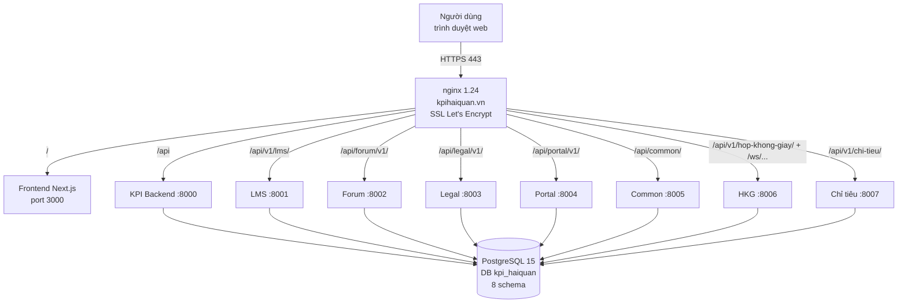

# Mục 5 — Thiết kế kỹ thuật, kiến trúc hệ thống, môi trường vận hành

> Phục vụ công văn 153/CNTT ngày 08/7/2026. Lập ngày 30/07/2026.

## 1. Mô hình kiến trúc tổng thể

Hệ thống theo mô hình **multi-service trên một máy chủ**: 1 frontend Next.js + 8 backend FastAPI độc lập, dùng chung 1 database PostgreSQL (tách schema theo module), toàn bộ đặt sau nginx reverse proxy với SSL.



## 2. Danh mục dịch vụ và cổng

| Service | Cổng | Thư mục mã nguồn | Đường dẫn public (sau nginx) | Trạng thái |
|---|---|---|---|---|
| Frontend (Next.js) | 3000 | `frontend/` | `https://kpihaiquan.vn/` | Production |
| KPI Backend | 8000 | `backend/app/` | `/api/*` | Production |
| LMS Backend | 8001 | `backend/lms_service/` | `/api/v1/lms/*`, `/uploads/lms/*` | Production |
| Forum Backend | 8002 | `backend/forum_service/` | `/api/forum/v1/*` | Production |
| Legal Backend | 8003 | `backend/legal_service/` | `/api/legal/v1/*`, `/uploads/legal/*` | Production |
| Portal Backend | 8004 | `backend/portal_service/` | `/api/portal/v1/*`, `/uploads/portal/*` | Production |
| Common Backend | 8005 | `backend/common_service/` | `/api/common/*`, `/internal/*` | Production |
| HKG Backend | 8006 | `backend/meeting_service/` | `/api/v1/hop-khong-giay/*`, `/ws/hop-khong-giay/*` (WebSocket) | Production |
| Chỉ tiêu Backend | 8007 | `backend/chi_tieu_service/` | `/api/v1/chi-tieu/*` | Production |

**Lưu ý an ninh:** các cổng 3000, 8000–8007 và PostgreSQL 5432 chỉ bind nội bộ máy chủ; bên ngoài chỉ truy cập được qua nginx (cổng 80 → redirect 443, cổng 443 SSL).

## 3. Tên miền, máy chủ, phương thức truy cập

| Hạng mục | Giá trị |
|---|---|
| Tên miền | `kpihaiquan.vn`, `www.kpihaiquan.vn` |
| Máy chủ production | Cloud VPS — IP `79.108.216.189` |
| Hệ điều hành | Ubuntu 24.04.4 LTS |
| Phương thức truy cập người dùng | HTTPS (TLS, chứng thư Let's Encrypt, tự gia hạn qua certbot) |
| Phương thức quản trị máy chủ | SSH (khóa/mật khẩu, cổng SSH) |
| Process manager | PM2 6.0.14 — 9 process, tự restart khi lỗi, log rotate (pm2-logrotate) |
| WebSocket | `/ws/hop-khong-giay/*` (trình chiếu tài liệu họp thời gian thực) |

## 4. Kiến trúc phần mềm nội bộ (mỗi backend)

Kiến trúc phân lớp thống nhất:

```
API endpoints (api/v1/endpoints/) → Services (services/) → Models/ORM (models/) → PostgreSQL
                 ↑
        Dependency Injection (deps.py): get_db (AsyncSession), get_current_user (JWT)
```

- Toàn bộ thao tác DB là **async** (SQLAlchemy 2.0 + asyncpg).
- Schema Pydantic (DTO) tách riêng tại `schemas/` — validate toàn bộ dữ liệu vào/ra.
- Response chuẩn hóa: `{"success": true/false, "data": ..., "message"/"error": ...}`.
- Migration schema DB bằng Alembic, tự chạy khi khởi động KPI backend.

## 5. Xác thực liên dịch vụ (SSO nội bộ)

- Đăng nhập duy nhất tại KPI Backend: `POST /api/v1/auth/login` → cấp JWT (HS256).
- JWT chứa: `sub` (id công chức), `ma_cc`, `vai_tro`, `don_vi_id`, `is_lanh_dao`, `exp`.
- Các service khác **tự verify JWT** bằng cùng SECRET_KEY (module `backend/shared/`) — không gọi lại KPI backend, không lưu session phía server.
- Token hết hạn sau 480 phút (8 giờ làm việc).

## 6. Kết nối kỹ thuật ra ngoài

| Kết nối | Chiều | Mục đích |
|---|---|---|
| Let's Encrypt (ACME) | ra ngoài | Gia hạn chứng thư SSL |
| Private GitHub repository | ra ngoài | Đẩy bản backup **đã mã hóa** (off-site backup, 2 lần/ngày) |
| Không có kết nối API với hệ thống ngoài khác | — | Hệ thống độc lập, không tích hợp hệ thống nghiệp vụ hải quan trung ương |
